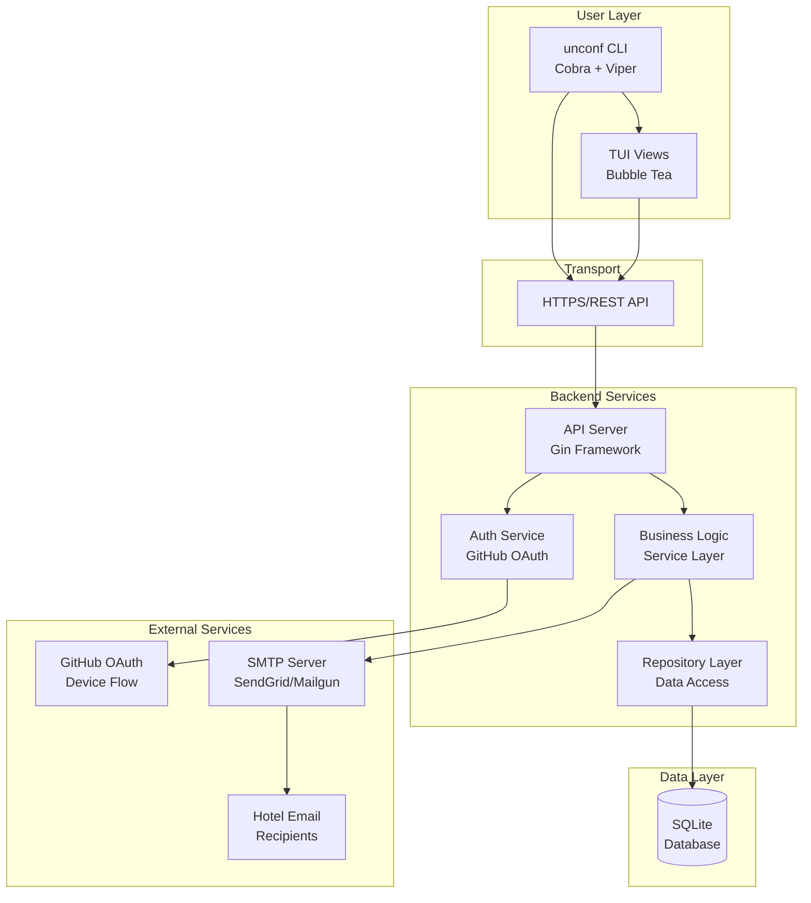
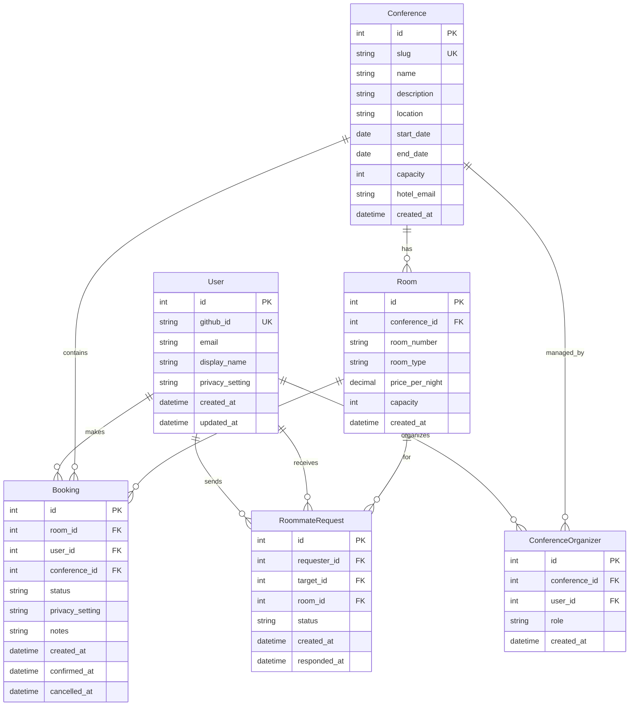
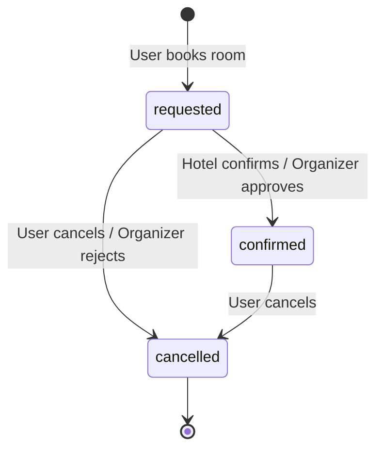
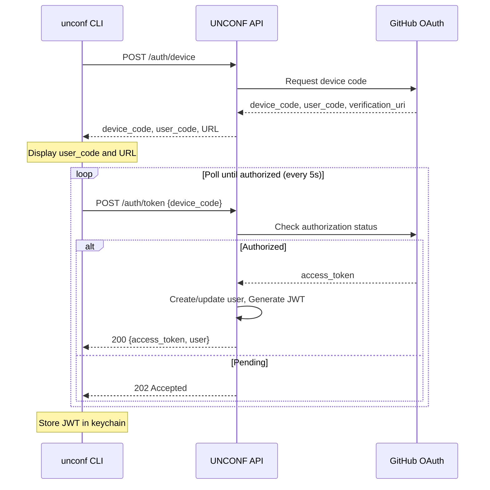
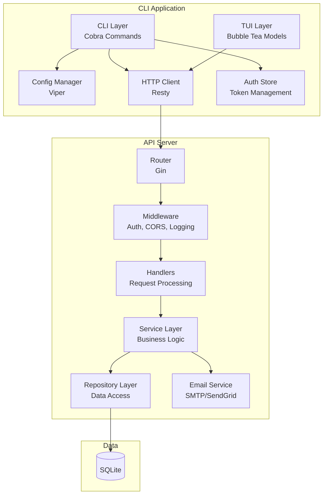
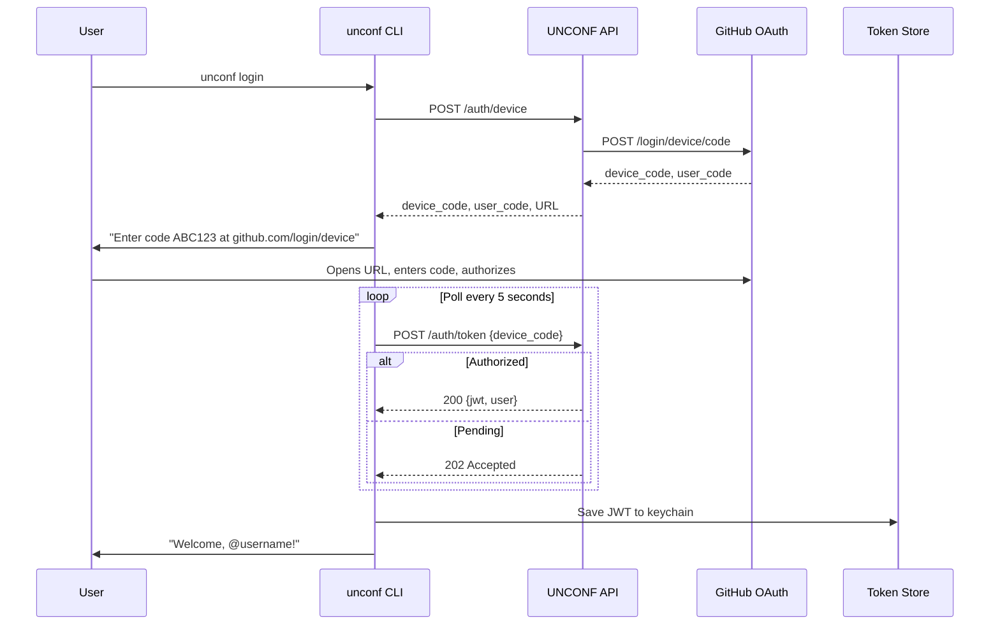
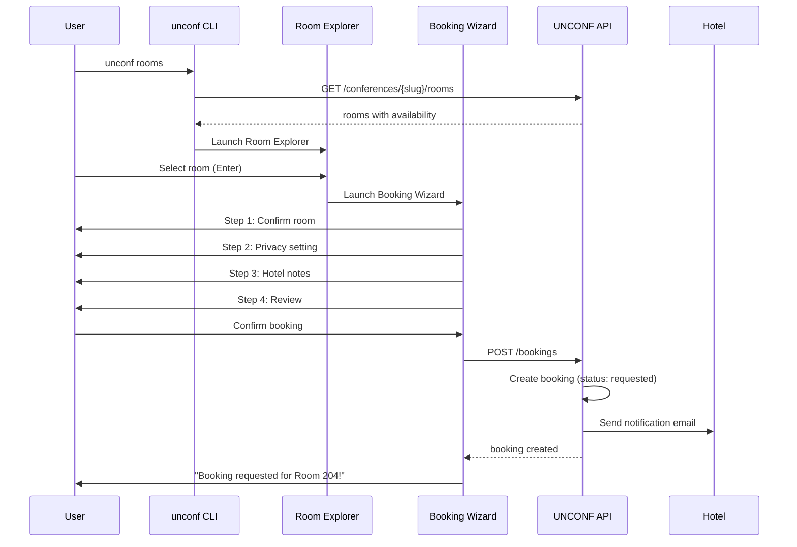
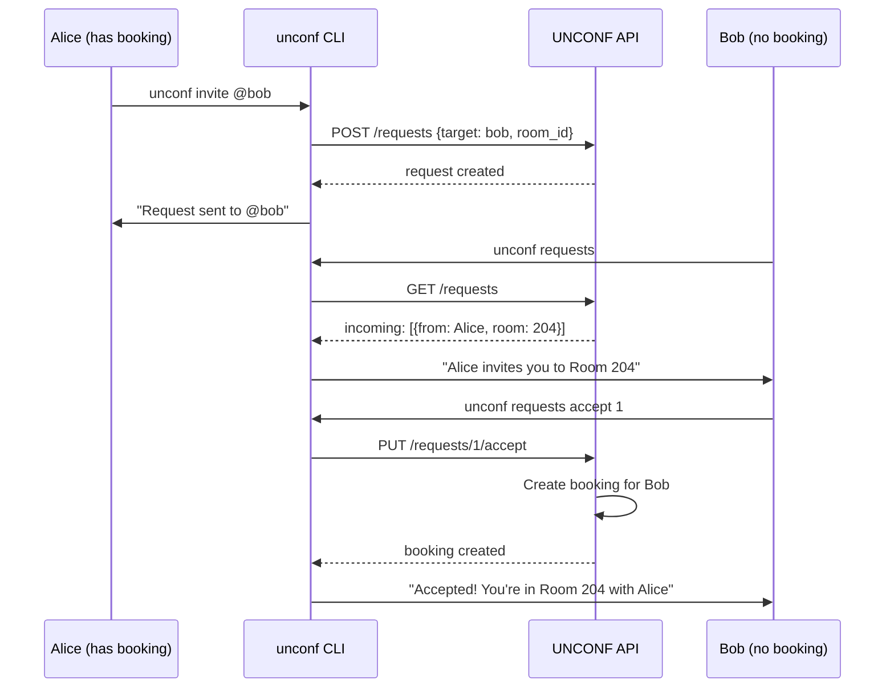
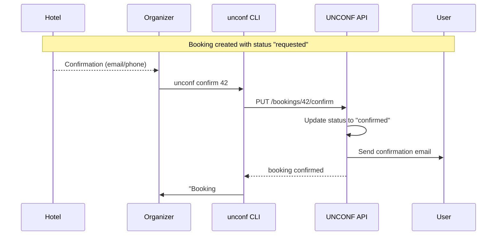

# UNCONF CLI Fullstack Architecture Document

**Version:** 1.0  
**Date:** January 31, 2026  
**Author:** Winston (Architect)  
**Status:** Ready for Development

---

## Table of Contents

1. [Introduction](#1-introduction)
2. [High Level Architecture](#2-high-level-architecture)
3. [Tech Stack](#3-tech-stack)
4. [Data Models](#4-data-models)
5. [API Specification](#5-api-specification)
6. [Components](#6-components)
7. [External APIs](#7-external-apis)
8. [Core Workflows](#8-core-workflows)
9. [Database Schema](#9-database-schema)
10. [CLI & Backend Architecture](#10-cli--backend-architecture)
11. [Unified Project Structure](#11-unified-project-structure)
12. [Development Workflow](#12-development-workflow)
13. [Deployment Architecture](#13-deployment-architecture)
14. [Security and Performance](#14-security-and-performance)
15. [Testing Strategy](#15-testing-strategy)
16. [Coding Standards](#16-coding-standards)
17. [Error Handling Strategy](#17-error-handling-strategy)
18. [Monitoring and Observability](#18-monitoring-and-observability)
19. [Checklist Results](#19-checklist-results)
20. [Glossary](#20-glossary)

---

## 1. Introduction

This document outlines the complete architecture for **UNCONF CLI**, a command-line application with text-based user interface (TUI) designed to streamline conference registration and hotel room booking for developer unconferences. It serves as the single source of truth for development, ensuring consistency across the CLI client, backend API, and infrastructure.

**Architecture Approach:** This is a **unified fullstack architecture** combining what would traditionally be separate CLI and backend documents. Since UNCONF is a Go-based monorepo where the CLI and API share code (types, constants, utilities), this integrated approach ensures coherent design decisions.

### 1.1 Starter Template or Existing Project

**N/A — Greenfield project**

The PRD specifies a greenfield Go project with standard layout. No starter template is being used; the architecture will establish patterns from scratch using:
- Go standard project layout (`/cmd`, `/internal`, `/pkg`)
- Cobra + Viper for CLI
- Bubble Tea + Lip Gloss for TUI
- Gin for REST API

### 1.2 Change Log

| Date | Version | Description | Author |
|------|---------|-------------|--------|
| Jan 31, 2026 | 1.0 | Initial architecture document | Winston (Architect) |

---

## 2. High Level Architecture

### 2.1 Technical Summary

UNCONF CLI follows a **CLI-as-API-client architecture** with a stateless Go backend. The CLI application (built with Cobra/Bubble Tea) makes authenticated HTTP calls to a RESTful API (built with Gin) that handles all business logic and data persistence. SQLite provides storage with a Repository pattern enabling future PostgreSQL migration. Authentication uses GitHub OAuth Device Flow, allowing CLI users to authenticate without browser redirects. The system deploys as a containerized backend on free-tier hosting (Fly.io) with the CLI distributed as cross-platform binaries via GitHub Releases and optional Homebrew tap.

### 2.2 Platform and Infrastructure Choice

**Evaluation of Options:**

| Platform | Pros | Cons | Fit |
|----------|------|------|-----|
| **Fly.io** | Free tier, global edge, simple Docker deploy, PostgreSQL add-on available | Limited free resources | ⭐ Best Fit |
| **Railway** | Free tier, auto-deploy from GitHub, good DX | Less mature than Fly.io | Good Alternative |
| **Render** | Free tier, managed services | Cold starts on free tier | Acceptable |
| **Self-hosted VPS** | Full control | Requires maintenance | Over-engineered |

**Recommendation: Fly.io**

**Rationale:** 
- Free tier sufficient for community project (256MB RAM, shared CPU)
- Native Docker support matches our containerization strategy
- Easy PostgreSQL migration path when SQLite outgrows needs
- Global edge network improves API latency for international attendees
- Simple secrets management for GitHub OAuth credentials

**Platform:** Fly.io  
**Key Services:** Fly Machines (container hosting), Fly Volumes (SQLite persistence), Fly Secrets (env vars)  
**Deployment Regions:** Primary: `fra` (Frankfurt) — central to European developer community

### 2.3 Repository Structure

**Structure:** Monorepo with Go standard layout  
**Monorepo Tool:** N/A (Go modules sufficient for single-service project)  
**Package Organization:** Internal packages for shared code

```
unconf/
├── cmd/
│   ├── unconf/           # CLI entry point
│   │   └── main.go
│   └── server/           # API server entry point
│       └── main.go
├── internal/
│   ├── cli/              # CLI commands (Cobra)
│   ├── tui/              # TUI components (Bubble Tea)
│   ├── api/              # HTTP handlers (Gin)
│   ├── service/          # Business logic layer
│   ├── repository/       # Data access layer
│   ├── models/           # Domain models
│   ├── auth/             # Authentication logic
│   └── email/            # Email templates & sending
├── migrations/           # Database migrations
├── docs/                 # Documentation
└── ...
```

### 2.4 High Level Architecture Diagram



### 2.5 Architectural Patterns

- **CLI-as-Client Pattern:** CLI makes HTTP calls to backend; no direct database access from CLI. *Rationale:* Clean separation enables independent CLI updates, consistent data access, and potential future web/mobile clients.

- **Repository Pattern:** Abstract data access behind interfaces. *Rationale:* Enables SQLite-to-PostgreSQL migration without business logic changes; improves testability with mock repositories.

- **Service Layer Pattern:** Business logic encapsulated in services, not handlers. *Rationale:* Handlers stay thin (validation, response formatting); business rules centralized and testable.

- **Device Flow OAuth:** GitHub authentication without browser redirects. *Rationale:* CLI users can't handle standard OAuth redirects; device flow provides secure authentication with user code display.

- **Command Pattern (Cobra):** Each CLI command is a self-contained unit. *Rationale:* Standard Go CLI convention; enables easy addition of new commands.

- **Model-View-Update (Bubble Tea):** TUI follows Elm architecture. *Rationale:* Built-in pattern for Bubble Tea; predictable state management for interactive interfaces.

---

## 3. Tech Stack

This is the **definitive technology selection** for UNCONF CLI. All development must use these exact technologies and versions.

| Category | Technology | Version | Purpose | Rationale |
|----------|------------|---------|---------|-----------|
| **Core Language** | Go | 1.21+ | CLI, API, all backend | Performance, single binary distribution, strong concurrency |
| **CLI Framework** | Cobra | v1.8+ | Command structure, flags, help | Industry standard (kubectl, gh, docker) |
| **CLI Config** | Viper | v1.18+ | Configuration management | Seamless Cobra integration, multi-source config |
| **TUI Framework** | Bubble Tea | v0.25+ | Interactive terminal UI | Best-in-class Go TUI, Charm ecosystem |
| **TUI Styling** | Lip Gloss | v0.10+ | Terminal styling, colors | Native Bubble Tea companion |
| **HTTP Framework** | Gin | v1.9+ | REST API routing | Fast, minimal, well-documented |
| **Database** | SQLite | 3.40+ | Data persistence | Simple, file-based, migration-ready |
| **DB Driver** | mattn/go-sqlite3 | v1.14+ | SQLite Go bindings | Most mature SQLite driver |
| **Migrations** | golang-migrate | v4.16+ | Schema migrations | Database-agnostic, CLI and library |
| **Authentication** | JWT | dgrijalva/jwt-go v5 | API token authentication | Stateless, standard |
| **OAuth Client** | golang.org/x/oauth2 | latest | GitHub OAuth integration | Official Go OAuth library |
| **HTTP Client** | net/http + resty | v2.11+ | CLI API calls | Resty for fluent API, retries |
| **Logging** | zerolog | v1.32+ | Structured logging | Fast, zero-allocation, JSON output |
| **Email** | gomail | v2.0+ | SMTP email sending | Simple, reliable SMTP client |
| **Validation** | go-playground/validator | v10+ | Input validation | Struct tags, comprehensive rules |
| **Testing** | go test + testify | v1.8+ | Unit & integration tests | Standard + assertions/mocks |
| **Linting** | golangci-lint | v1.55+ | Static analysis | Multi-linter aggregator |
| **Build Tool** | Make | - | Task runner | Universal, simple |
| **Release** | GoReleaser | v1.24+ | Cross-platform builds | Automated releases, checksums |
| **CI/CD** | GitHub Actions | - | Continuous integration | Native GitHub integration |
| **Containerization** | Docker | 24+ | Backend deployment | Standard containerization |
| **Hosting** | Fly.io | - | Production deployment | Free tier, Docker support |
| **Dev Email** | MailHog | v1.0+ | Local email testing | Captures SMTP in development |
| **Prod Email** | SendGrid | API v3 | Production email delivery | Reliable, free tier available |

---

## 4. Data Models

### 4.1 Entity Relationship Overview



### 4.2 User

**Purpose:** Represents an authenticated attendee or organizer.

```go
type User struct {
    ID             int64     `json:"id" db:"id"`
    GitHubID       string    `json:"github_id" db:"github_id"`
    Email          string    `json:"email" db:"email"`
    DisplayName    string    `json:"display_name" db:"display_name"`
    PrivacySetting string    `json:"privacy_setting" db:"privacy_setting"`
    CreatedAt      time.Time `json:"created_at" db:"created_at"`
    UpdatedAt      time.Time `json:"updated_at" db:"updated_at"`
}
```

### 4.3 Conference

**Purpose:** Represents an unconference event with room inventory.

```go
type Conference struct {
    ID          int64     `json:"id" db:"id"`
    Slug        string    `json:"slug" db:"slug"`
    Name        string    `json:"name" db:"name"`
    Description string    `json:"description" db:"description"`
    Location    string    `json:"location" db:"location"`
    StartDate   time.Time `json:"start_date" db:"start_date"`
    EndDate     time.Time `json:"end_date" db:"end_date"`
    Capacity    int       `json:"capacity" db:"capacity"`
    HotelEmail  string    `json:"hotel_email" db:"hotel_email"`
    CreatedAt   time.Time `json:"created_at" db:"created_at"`
}
```

### 4.4 Room

**Purpose:** Represents a hotel room available for booking.

```go
type Room struct {
    ID            int64     `json:"id" db:"id"`
    ConferenceID  int64     `json:"conference_id" db:"conference_id"`
    RoomNumber    string    `json:"room_number" db:"room_number"`
    RoomType      string    `json:"room_type" db:"room_type"`
    PricePerNight float64   `json:"price_per_night" db:"price_per_night"`
    Capacity      int       `json:"capacity" db:"capacity"`
    CreatedAt     time.Time `json:"created_at" db:"created_at"`
}
```

### 4.5 Booking

**Purpose:** Represents a user's room reservation with hotel confirmation workflow.

```go
type BookingStatus string

const (
    BookingStatusRequested BookingStatus = "requested"
    BookingStatusConfirmed BookingStatus = "confirmed"
    BookingStatusCancelled BookingStatus = "cancelled"
)

type Booking struct {
    ID             int64          `json:"id" db:"id"`
    RoomID         int64          `json:"room_id" db:"room_id"`
    UserID         int64          `json:"user_id" db:"user_id"`
    ConferenceID   int64          `json:"conference_id" db:"conference_id"`
    Status         BookingStatus  `json:"status" db:"status"`
    PrivacySetting string         `json:"privacy_setting" db:"privacy_setting"`
    Notes          string         `json:"notes" db:"notes"`
    CreatedAt      time.Time      `json:"created_at" db:"created_at"`
    ConfirmedAt    *time.Time     `json:"confirmed_at,omitempty" db:"confirmed_at"`
    CancelledAt    *time.Time     `json:"cancelled_at,omitempty" db:"cancelled_at"`
}
```

**Status Flow:**



### 4.6 RoommateRequest

**Purpose:** Represents an invitation to share a room.

```go
type RoommateRequest struct {
    ID          int64      `json:"id" db:"id"`
    RequesterID int64      `json:"requester_id" db:"requester_id"`
    TargetID    int64      `json:"target_id" db:"target_id"`
    RoomID      int64      `json:"room_id" db:"room_id"`
    Status      string     `json:"status" db:"status"`
    CreatedAt   time.Time  `json:"created_at" db:"created_at"`
    RespondedAt *time.Time `json:"responded_at,omitempty" db:"responded_at"`
}
```

### 4.7 ConferenceOrganizer

**Purpose:** Junction table linking users to conferences they organize.

```go
type ConferenceOrganizer struct {
    ID           int64     `json:"id" db:"id"`
    ConferenceID int64     `json:"conference_id" db:"conference_id"`
    UserID       int64     `json:"user_id" db:"user_id"`
    Role         string    `json:"role" db:"role"`
    CreatedAt    time.Time `json:"created_at" db:"created_at"`
}
```

---

## 5. API Specification

UNCONF uses a **RESTful API** with JSON payloads.

**Base URL:** `https://api.unconf.dev/v1` (production)  
**Content-Type:** `application/json`  
**Authentication:** Bearer token (JWT) for protected endpoints

### 5.1 Endpoints Summary

| Method | Path | Description | Auth |
|--------|------|-------------|------|
| GET | /health | Health check | No |
| POST | /auth/device | Initiate GitHub device flow | No |
| POST | /auth/token | Exchange device code for token | No |
| GET | /conferences | List conferences | No |
| GET | /conferences/{slug} | Get conference details | No |
| POST | /conferences | Create conference | Yes (Organizer) |
| GET | /conferences/{slug}/attendees | List attendees | Yes |
| GET | /conferences/{slug}/rooms | List rooms with availability | No |
| POST | /conferences/{slug}/rooms | Add room | Yes (Organizer) |
| GET | /bookings | Get user's bookings | Yes |
| POST | /bookings | Create booking | Yes |
| DELETE | /bookings/{id} | Cancel booking | Yes |
| PUT | /bookings/{id}/confirm | Confirm booking | Yes (Organizer) |
| GET | /requests | Get roommate requests | Yes |
| POST | /requests | Send roommate request | Yes |
| PUT | /requests/{id}/accept | Accept request | Yes |
| PUT | /requests/{id}/decline | Decline request | Yes |
| GET | /users/me | Get current user | Yes |
| PUT | /users/me | Update profile | Yes |
| GET | /conferences/{slug}/export | Export CSV | Yes (Organizer) |

### 5.2 Authentication Flow



---

## 6. Components

### 6.1 Component Overview



### 6.2 Component Responsibilities

| Component | Responsibility |
|-----------|----------------|
| **CLI Layer** | Parse commands, flags; orchestrate TUI and API calls |
| **TUI Layer** | Render interactive terminal interfaces (rooms, wizard, dashboard) |
| **Config Manager** | Load/save configuration from multiple sources |
| **HTTP Client** | Make authenticated API calls with retry logic |
| **Auth Store** | Secure token storage (OS keychain) |
| **API Router** | Route HTTP requests, apply middleware |
| **Middleware** | Auth, CORS, logging, recovery |
| **Handlers** | Request validation, response formatting |
| **Service Layer** | Business logic (BookingService, RoomService, etc.) |
| **Repository Layer** | Data access abstraction |
| **Email Service** | Template rendering, SMTP delivery |

---

## 7. External APIs

### 7.1 GitHub OAuth API

- **Purpose:** User authentication via GitHub Device Flow
- **Documentation:** https://docs.github.com/en/apps/oauth-apps/building-oauth-apps/authorizing-oauth-apps#device-flow
- **Base URL:** https://github.com/login/device/code
- **Authentication:** Client ID + Client Secret
- **Required Scopes:** `read:user, user:email`

### 7.2 SendGrid Email API

- **Purpose:** Production email delivery to hotels
- **Documentation:** https://docs.sendgrid.com/api-reference/mail-send/mail-send
- **Base URL:** https://api.sendgrid.com/v3/mail/send
- **Authentication:** API Key (Bearer token)
- **Rate Limits:** Free tier: 100 emails/day

---

## 8. Core Workflows

### 8.1 User Login Flow



### 8.2 Room Booking Flow (TUI)



### 8.3 Roommate Request Flow



### 8.4 Booking Confirmation Flow (Organizer)



---

## 9. Database Schema

### 9.1 Schema DDL

```sql
-- Users table
CREATE TABLE users (
    id INTEGER PRIMARY KEY AUTOINCREMENT,
    github_id TEXT NOT NULL UNIQUE,
    email TEXT NOT NULL,
    display_name TEXT NOT NULL,
    privacy_setting TEXT NOT NULL DEFAULT 'public' CHECK (privacy_setting IN ('public', 'private')),
    created_at DATETIME NOT NULL DEFAULT CURRENT_TIMESTAMP,
    updated_at DATETIME NOT NULL DEFAULT CURRENT_TIMESTAMP
);

CREATE INDEX idx_users_github_id ON users(github_id);

-- Conferences table
CREATE TABLE conferences (
    id INTEGER PRIMARY KEY AUTOINCREMENT,
    slug TEXT NOT NULL UNIQUE,
    name TEXT NOT NULL,
    description TEXT,
    location TEXT NOT NULL,
    start_date DATE NOT NULL,
    end_date DATE NOT NULL,
    capacity INTEGER NOT NULL,
    hotel_email TEXT,
    created_at DATETIME NOT NULL DEFAULT CURRENT_TIMESTAMP
);

CREATE INDEX idx_conferences_slug ON conferences(slug);

-- Conference organizers junction table
CREATE TABLE conference_organizers (
    id INTEGER PRIMARY KEY AUTOINCREMENT,
    conference_id INTEGER NOT NULL REFERENCES conferences(id) ON DELETE CASCADE,
    user_id INTEGER NOT NULL REFERENCES users(id) ON DELETE CASCADE,
    role TEXT NOT NULL DEFAULT 'admin' CHECK (role IN ('owner', 'admin')),
    created_at DATETIME NOT NULL DEFAULT CURRENT_TIMESTAMP,
    UNIQUE(conference_id, user_id)
);

-- Rooms table
CREATE TABLE rooms (
    id INTEGER PRIMARY KEY AUTOINCREMENT,
    conference_id INTEGER NOT NULL REFERENCES conferences(id) ON DELETE CASCADE,
    room_number TEXT NOT NULL,
    room_type TEXT NOT NULL CHECK (room_type IN ('single', 'double', 'triple')),
    price_per_night REAL NOT NULL,
    capacity INTEGER NOT NULL,
    created_at DATETIME NOT NULL DEFAULT CURRENT_TIMESTAMP,
    UNIQUE(conference_id, room_number)
);

CREATE INDEX idx_rooms_conference ON rooms(conference_id);

-- Bookings table
CREATE TABLE bookings (
    id INTEGER PRIMARY KEY AUTOINCREMENT,
    room_id INTEGER NOT NULL REFERENCES rooms(id) ON DELETE RESTRICT,
    user_id INTEGER NOT NULL REFERENCES users(id) ON DELETE RESTRICT,
    conference_id INTEGER NOT NULL REFERENCES conferences(id) ON DELETE RESTRICT,
    status TEXT NOT NULL DEFAULT 'requested' CHECK (status IN ('requested', 'confirmed', 'cancelled')),
    privacy_setting TEXT NOT NULL DEFAULT 'public' CHECK (privacy_setting IN ('public', 'private')),
    notes TEXT,
    created_at DATETIME NOT NULL DEFAULT CURRENT_TIMESTAMP,
    confirmed_at DATETIME,
    cancelled_at DATETIME
);

CREATE INDEX idx_bookings_room ON bookings(room_id);
CREATE INDEX idx_bookings_user ON bookings(user_id);
CREATE INDEX idx_bookings_conference ON bookings(conference_id);

-- Partial unique index: one active booking per user per conference
CREATE UNIQUE INDEX idx_bookings_user_conference_active 
    ON bookings(user_id, conference_id) 
    WHERE status != 'cancelled';

-- Roommate requests table
CREATE TABLE roommate_requests (
    id INTEGER PRIMARY KEY AUTOINCREMENT,
    requester_id INTEGER NOT NULL REFERENCES users(id) ON DELETE CASCADE,
    target_id INTEGER NOT NULL REFERENCES users(id) ON DELETE CASCADE,
    room_id INTEGER NOT NULL REFERENCES rooms(id) ON DELETE CASCADE,
    status TEXT NOT NULL DEFAULT 'pending' CHECK (status IN ('pending', 'accepted', 'declined')),
    created_at DATETIME NOT NULL DEFAULT CURRENT_TIMESTAMP,
    responded_at DATETIME,
    CHECK (requester_id != target_id)
);

-- Email log for audit trail
CREATE TABLE email_logs (
    id INTEGER PRIMARY KEY AUTOINCREMENT,
    booking_id INTEGER REFERENCES bookings(id) ON DELETE SET NULL,
    email_type TEXT NOT NULL CHECK (email_type IN ('booking', 'cancellation', 'confirmation')),
    recipient TEXT NOT NULL,
    subject TEXT NOT NULL,
    sent_at DATETIME NOT NULL DEFAULT CURRENT_TIMESTAMP,
    status TEXT NOT NULL DEFAULT 'sent' CHECK (status IN ('sent', 'failed', 'queued')),
    error_message TEXT
);
```

---

## 10. CLI & Backend Architecture

### 10.1 CLI Command Organization

```
internal/cli/
├── root.go           # Root command, global flags
├── login.go          # unconf login
├── logout.go         # unconf logout
├── list.go           # unconf list
├── info.go           # unconf info <slug>
├── checkout.go       # unconf checkout <slug>
├── config.go         # unconf config
├── rooms.go          # unconf rooms (TUI)
├── book.go           # unconf book <room>
├── status.go         # unconf status
├── cancel.go         # unconf cancel
├── invite.go         # unconf invite <username>
├── requests.go       # unconf requests
├── attendees.go      # unconf attendees
├── dashboard.go      # unconf dashboard (organizer)
├── create.go         # unconf create (organizer)
├── confirm.go        # unconf confirm (organizer)
└── export.go         # unconf export (organizer)
```

### 10.2 TUI Architecture (Bubble Tea)

```go
// Model-View-Update pattern
type RoomExplorerModel struct {
    rooms       []api.RoomWithAvailability
    cursor      int
    filter      string
    loading     bool
    err         error
    styles      Styles
}

func (m RoomExplorerModel) Init() tea.Cmd { return m.loadRooms }
func (m RoomExplorerModel) Update(msg tea.Msg) (tea.Model, tea.Cmd) { /* handle input */ }
func (m RoomExplorerModel) View() string { /* render UI */ }
```

### 10.3 API Server Architecture

```
internal/api/
├── routes.go         # Route definitions
├── middleware/
│   ├── auth.go       # JWT authentication
│   ├── cors.go       # CORS configuration
│   ├── logger.go     # Request logging
│   └── organizer.go  # Organizer permission check
├── handlers/
│   ├── health.go
│   ├── auth.go
│   ├── conferences.go
│   ├── rooms.go
│   ├── bookings.go
│   ├── requests.go
│   ├── users.go
│   └── organizer.go
└── responses/
    ├── success.go
    └── errors.go
```

---

## 11. Unified Project Structure

```
unconf/
├── .github/
│   └── workflows/
│       ├── ci.yaml              # Test, lint on PR
│       ├── release.yaml         # GoReleaser on tag
│       └── deploy.yaml          # Deploy to Fly.io
├── cmd/
│   ├── unconf/                  # CLI binary
│   │   └── main.go
│   └── server/                  # API server binary
│       └── main.go
├── internal/
│   ├── api/                     # HTTP API (Gin)
│   ├── cli/                     # CLI commands (Cobra)
│   ├── tui/                     # TUI components (Bubble Tea)
│   ├── service/                 # Business logic
│   ├── repository/              # Data access
│   │   ├── interfaces.go
│   │   └── sqlite/
│   ├── models/                  # Domain models
│   ├── auth/                    # Authentication
│   ├── email/                   # Email service
│   ├── config/                  # Configuration
│   └── client/                  # HTTP client for CLI
├── migrations/                  # Database migrations
├── configs/                     # Configuration files
├── scripts/                     # Build/deploy scripts
├── docs/                        # Documentation
├── Dockerfile
├── docker-compose.yml
├── fly.toml
├── Makefile
├── .goreleaser.yaml
├── .golangci.yaml
├── go.mod
└── README.md
```

---

## 12. Development Workflow

### 12.1 Prerequisites

```bash
go version   # 1.21 or higher
sqlite3      # For local database
docker       # For MailHog

# Recommended
brew install golangci-lint
brew install golang-migrate
```

### 12.2 Initial Setup

```bash
git clone https://github.com/unconf/unconf.git
cd unconf
go mod download
cp configs/config.example.yaml ~/.unconf/config.yaml
make migrate-up
make test
```

### 12.3 Development Commands

```bash
# Start server + MailHog
docker-compose up -d

# Run server
make run-server

# Run CLI
make run-cli -- login
make run-cli -- rooms

# Tests
make test
make test-coverage

# Lint
make lint

# Migrations
make migrate-up
make migrate-down
```

### 12.4 Environment Variables

```bash
# Server (.env)
PORT=8080
DATABASE_URL=sqlite3://./unconf.db
JWT_SECRET=your-dev-secret-min-32-chars
GITHUB_CLIENT_ID=xxx
GITHUB_CLIENT_SECRET=xxx
SMTP_HOST=localhost
SMTP_PORT=1025

# CLI (~/.unconf/config.yaml)
api_endpoint: http://localhost:8080/v1
```

---

## 13. Deployment Architecture

### 13.1 Deployment Strategy

**CLI Distribution:**
- GitHub Releases (GoReleaser)
- Homebrew tap for macOS
- Cross-platform: linux, darwin, windows × amd64, arm64

**Server Deployment:**
- Fly.io with Docker
- Tag-triggered via GitHub Actions

### 13.2 CI/CD Pipeline

```yaml
# ci.yaml - Tests on every PR
# release.yaml - GoReleaser on tag
# deploy.yaml - Fly.io deploy on tag
```

### 13.3 Environments

| Environment | API URL | Purpose |
|-------------|---------|---------|
| Development | http://localhost:8080/v1 | Local development |
| Production | https://api.unconf.dev/v1 | Live environment |

---

## 14. Security and Performance

### 14.1 Security Requirements

- **Token Storage:** OS keychain (macOS Keychain, Linux Secret Service, Windows Credential Manager)
- **HTTPS:** All production traffic over TLS
- **JWT:** 24-hour expiry
- **Input Validation:** All inputs validated via `go-playground/validator`
- **SQL Injection:** Parameterized queries only

### 14.2 Performance Targets

- **API Response Time:** < 200ms (NFR1)
- **TUI Render:** 60 FPS (NFR2)
- **Database:** SQLite with WAL mode

### 14.3 Scalability

**Current Limits (SQLite):**
- Concurrent users: ~100
- Database size: ~10GB

**PostgreSQL Migration Triggers:**
- Multiple concurrent conferences
- More than 500 active users

---

## 15. Testing Strategy

### 15.1 Testing Pyramid

- **60% Unit Tests** — Service layer with mocked dependencies
- **30% Integration Tests** — Repository with in-memory SQLite
- **10% E2E Tests** — Manual (TUI difficult to automate)

### 15.2 Test Examples

```go
// Unit test
func TestBookingService_CreateBooking_RoomFull(t *testing.T) {
    mockRepo := new(MockBookingRepo)
    // ... assertions
}

// Integration test
func TestBookingRepository_Create(t *testing.T) {
    db := setupTestDB(t) // in-memory SQLite
    // ... assertions
}
```

### 15.3 E2E Testing (Manual)

| Scenario | Steps | Expected |
|----------|-------|----------|
| Login flow | `unconf login` | Token stored |
| Room booking | TUI → Wizard | Booking created |
| Cancellation | `unconf cancel` | Booking cancelled |

---

## 16. Coding Standards

### 16.1 Critical Rules

1. **Repository Pattern:** All DB access through repository interfaces
2. **Error Wrapping:** `fmt.Errorf("context: %w", err)`
3. **Context Propagation:** Pass `context.Context` to all I/O functions
4. **Logging:** Use `zerolog`, never `fmt.Println`
5. **Config:** Use Viper wrapper, never `os.Getenv` directly
6. **No Globals:** Dependency injection only
7. **Defer Cleanup:** Always `defer rows.Close()`

### 16.2 Naming Conventions

| Element | Convention | Example |
|---------|------------|---------|
| Packages | lowercase | `service`, `repository` |
| Interfaces | PascalCase | `BookingRepository` |
| Files | snake_case | `booking_service.go` |
| API routes | kebab-case | `/roommate-requests` |
| DB tables | snake_case | `roommate_requests` |

### 16.3 Git Commits

```
type(scope): description

feat(booking): add roommate request flow
fix(tui): prevent crash on empty room list
```

---

## 17. Error Handling Strategy

### 17.1 Error Response Format

```json
{
    "error": {
        "code": "room_full",
        "message": "Room 204 has no available spots",
        "timestamp": "2026-01-31T10:30:00Z"
    }
}
```

### 17.2 Domain Errors

```go
var (
    ErrRoomFull       = errors.New("room is at capacity")
    ErrAlreadyBooked  = errors.New("user already has a booking")
    ErrBookingNotFound = errors.New("booking not found")
    ErrUnauthorized   = errors.New("unauthorized")
    ErrForbidden      = errors.New("forbidden")
)
```

### 17.3 CLI Error Display

```go
func HandleError(err error) {
    if apiErr, ok := err.(*client.APIError); ok {
        fmt.Fprintf(os.Stderr, "Error: %s\n", apiErr.Message)
        // Show helpful tip based on error code
    }
    os.Exit(1)
}
```

---

## 18. Monitoring and Observability

### 18.1 Monitoring Stack

| Component | Tool |
|-----------|------|
| Logging | zerolog (JSON) |
| Log Aggregation | Fly.io logs |
| Metrics | Fly.io dashboard |
| Health Check | `/health` endpoint |

### 18.2 Key Metrics

- Request count by endpoint
- Response time percentiles
- Error rate
- Bookings created/cancelled
- Email delivery success rate

### 18.3 Health Check

```go
func (h *HealthHandler) Health(c *gin.Context) {
    if err := h.db.Ping(); err != nil {
        c.JSON(503, gin.H{"status": "unhealthy"})
        return
    }
    c.JSON(200, gin.H{"status": "ok", "version": Version})
}
```

---

## 19. Checklist Results

### Executive Summary

| Metric | Result |
|--------|--------|
| **Architecture Completeness** | 95% |
| **PRD Alignment** | Full |
| **Implementation Readiness** | Ready for Development |

### Checklist

| # | Requirement | Status |
|---|-------------|--------|
| 1 | High-level architecture diagram | ✅ |
| 2 | Tech stack with versions | ✅ |
| 3 | Data models documented | ✅ |
| 4 | API specification | ✅ |
| 5 | Database schema | ✅ |
| 6 | Component definitions | ✅ |
| 7 | External API integrations | ✅ |
| 8 | Core workflows | ✅ |
| 9 | Security requirements | ✅ |
| 10 | Performance targets | ✅ |
| 11 | Testing strategy | ✅ |
| 12 | Deployment architecture | ✅ |
| 13 | Coding standards | ✅ |
| 14 | Error handling | ✅ |
| 15 | Monitoring | ✅ |

### PRD Alignment

All functional requirements (FR1-FR24) and non-functional requirements (NFR1-NFR12) are addressed in this architecture.

### Risks & Mitigations

| Risk | Mitigation |
|------|------------|
| SQLite concurrent write limits | Repository pattern enables PostgreSQL migration |
| TUI terminal compatibility | Standard color scheme, graceful fallback |
| GitHub OAuth outage | Retry logic, clear user messaging |
| Email delivery failures | Retry queue, organizer BCC, logging |

---

## Next Steps

1. **Epic 1 Stories:** Begin with project scaffolding (Story 1.1)
2. **CI/CD Setup:** Configure GitHub Actions early
3. **Development Environment:** Docker Compose + MailHog
4. **First Milestone:** Working `unconf login` command

---

## 20. Glossary

### Domain Terms

| Term | Definition |
|------|------------|
| **Unconference** | A participant-driven meeting format (also called Open Space) where the agenda is created by attendees on the day. Examples: SoCraTes Italia, Polenta & Deploy |
| **Attendee** | A user who has a booking (active or requested) for a conference. Implicit role — no separate entity |
| **Organizer** | A user with owner or admin role for a conference. Can view all attendee data and confirm bookings |
| **Roommate** | A user sharing a hotel room with another attendee. Created via roommate request flow |
| **Privacy Setting** | User's visibility preference: **Public** (name shown to other attendees) or **Private** (appears as "Private attendee") |
| **Context** | The currently selected conference for CLI commands. Set via `unconf checkout <slug>` |
| **Booking Status** | Lifecycle state of a reservation: **requested** → **confirmed** → **cancelled** |

### Technical Terms

| Term | Definition |
|------|------------|
| **Device Flow** | OAuth 2.0 authentication method for CLI applications. User enters a code at a URL rather than being redirected |
| **TUI** | Text User Interface — interactive terminal application (vs GUI). Built with Bubble Tea |
| **Repository Pattern** | Design pattern that abstracts data access behind interfaces, enabling database swaps without changing business logic |
| **Service Layer** | Layer containing business logic, sitting between handlers (HTTP) and repositories (data) |
| **WAL Mode** | Write-Ahead Logging — SQLite configuration enabling concurrent reads while writing |
| **JWT** | JSON Web Token — stateless authentication token containing encoded claims |
| **Monorepo** | Single repository containing multiple related projects/packages (CLI + server in this case) |

### UNCONF CLI Commands

| Command | Purpose |
|---------|---------|
| `unconf login` | Authenticate with GitHub |
| `unconf logout` | Clear stored credentials |
| `unconf list` | Show available conferences |
| `unconf info <slug>` | Show conference details |
| `unconf checkout <slug>` | Set active conference context |
| `unconf rooms` | Launch room explorer TUI |
| `unconf book <room>` | Book a room directly |
| `unconf status` | Show current booking |
| `unconf cancel` | Cancel booking |
| `unconf invite <user>` | Send roommate request |
| `unconf requests` | Manage roommate requests |
| `unconf attendees` | List conference attendees |
| `unconf config` | Update profile settings |
| `unconf dashboard` | Organizer dashboard TUI |
| `unconf confirm <id>` | Confirm booking (organizer) |
| `unconf export` | Export CSV (organizer) |

### API Status Codes

| Code | Meaning | When Used |
|------|---------|-----------|
| 200 | OK | Successful GET, PUT, DELETE |
| 201 | Created | Successful POST (resource created) |
| 202 | Accepted | Auth polling (pending authorization) |
| 400 | Bad Request | Validation error, business rule violation |
| 401 | Unauthorized | Missing or invalid token |
| 403 | Forbidden | Valid token but insufficient permissions |
| 404 | Not Found | Resource doesn't exist |
| 500 | Internal Server Error | Unexpected server error |

### Acronyms

| Acronym | Expansion |
|---------|-----------|
| **API** | Application Programming Interface |
| **CLI** | Command-Line Interface |
| **CORS** | Cross-Origin Resource Sharing |
| **CRUD** | Create, Read, Update, Delete |
| **DX** | Developer Experience |
| **MVP** | Minimum Viable Product |
| **NFR** | Non-Functional Requirement |
| **OAuth** | Open Authorization |
| **REST** | Representational State Transfer |
| **SMTP** | Simple Mail Transfer Protocol |
| **SQL** | Structured Query Language |
| **TLS** | Transport Layer Security (HTTPS) |
| **TUI** | Text User Interface |
| **UX** | User Experience |

---

*Document created by Winston (Architect) using BMAD Method*  
*Based on: docs/prd.md, docs/brief.md*
