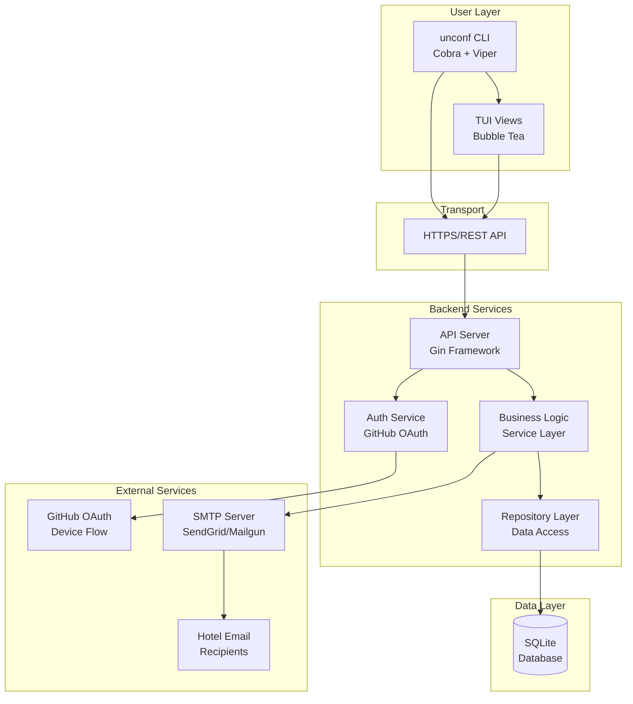

# 2. High Level Architecture

## 2.1 Technical Summary

UNCONF CLI follows a **CLI-as-API-client architecture** with a stateless Go backend. The CLI application (built with Cobra/Bubble Tea) makes authenticated HTTP calls to a RESTful API (built with Gin) that handles all business logic and data persistence. SQLite provides storage with a Repository pattern enabling future PostgreSQL migration. Authentication uses GitHub OAuth Device Flow, allowing CLI users to authenticate without browser redirects. The system deploys as a containerized backend on free-tier hosting (Fly.io) with the CLI distributed as cross-platform binaries via GitHub Releases and optional Homebrew tap.

## 2.2 Platform and Infrastructure Choice

**Evaluation of Options:**

| Platform | Pros | Cons | Fit |
|----------|------|------|-----|
| **Fly.io** | Free tier, global edge, simple Docker deploy, PostgreSQL add-on available | Limited free resources | ⭐ Best Fit |
| **Railway** | Free tier, auto-deploy from GitHub, good DX | Less mature than Fly.io | Good Alternative |
| **Render** | Free tier, managed services | Cold starts on free tier | Acceptable |
| **Self-hosted VPS** | Full control | Requires maintenance | Over-engineered |

**Recommendation: Fly.io**

**Rationale:** 
- Free tier sufficient for community project (256MB RAM, shared CPU)
- Native Docker support matches our containerization strategy
- Easy PostgreSQL migration path when SQLite outgrows needs
- Global edge network improves API latency for international attendees
- Simple secrets management for GitHub OAuth credentials

**Platform:** Fly.io  
**Key Services:** Fly Machines (container hosting), Fly Volumes (SQLite persistence), Fly Secrets (env vars)  
**Deployment Regions:** Primary: `fra` (Frankfurt) — central to European developer community

## 2.3 Repository Structure

**Structure:** Monorepo with Go standard layout  
**Monorepo Tool:** N/A (Go modules sufficient for single-service project)  
**Package Organization:** Internal packages for shared code

```
unconf/
├── cmd/
│   ├── unconf/           # CLI entry point
│   │   └── main.go
│   └── server/           # API server entry point
│       └── main.go
├── internal/
│   ├── cli/              # CLI commands (Cobra)
│   ├── tui/              # TUI components (Bubble Tea)
│   ├── api/              # HTTP handlers (Gin)
│   ├── service/          # Business logic layer
│   ├── repository/       # Data access layer
│   ├── models/           # Domain models
│   ├── auth/             # Authentication logic
│   └── email/            # Email templates & sending
├── migrations/           # Database migrations
├── docs/                 # Documentation
└── ...
```

## 2.4 High Level Architecture Diagram



## 2.5 Architectural Patterns

- **CLI-as-Client Pattern:** CLI makes HTTP calls to backend; no direct database access from CLI. *Rationale:* Clean separation enables independent CLI updates, consistent data access, and potential future web/mobile clients.

- **Repository Pattern:** Abstract data access behind interfaces. *Rationale:* Enables SQLite-to-PostgreSQL migration without business logic changes; improves testability with mock repositories.

- **Service Layer Pattern:** Business logic encapsulated in services, not handlers. *Rationale:* Handlers stay thin (validation, response formatting); business rules centralized and testable.

- **Device Flow OAuth:** GitHub authentication without browser redirects. *Rationale:* CLI users can't handle standard OAuth redirects; device flow provides secure authentication with user code display.

- **Command Pattern (Cobra):** Each CLI command is a self-contained unit. *Rationale:* Standard Go CLI convention; enables easy addition of new commands.

- **Model-View-Update (Bubble Tea):** TUI follows Elm architecture. *Rationale:* Built-in pattern for Bubble Tea; predictable state management for interactive interfaces.

---
