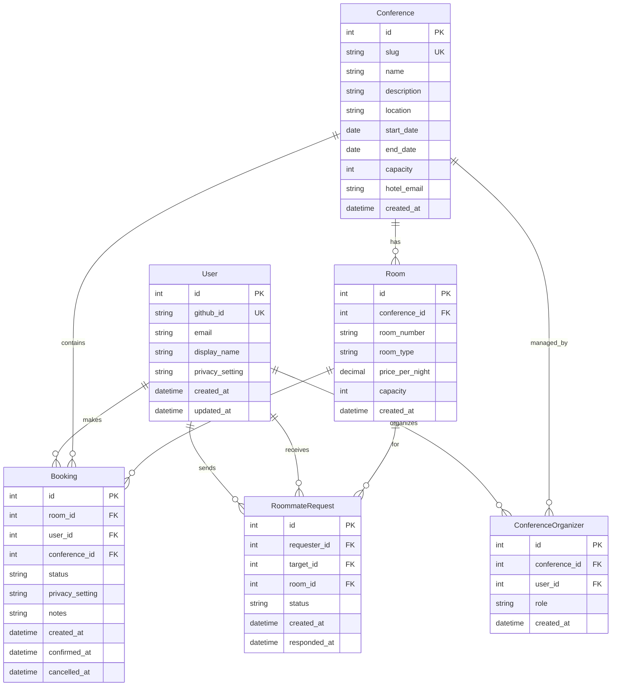
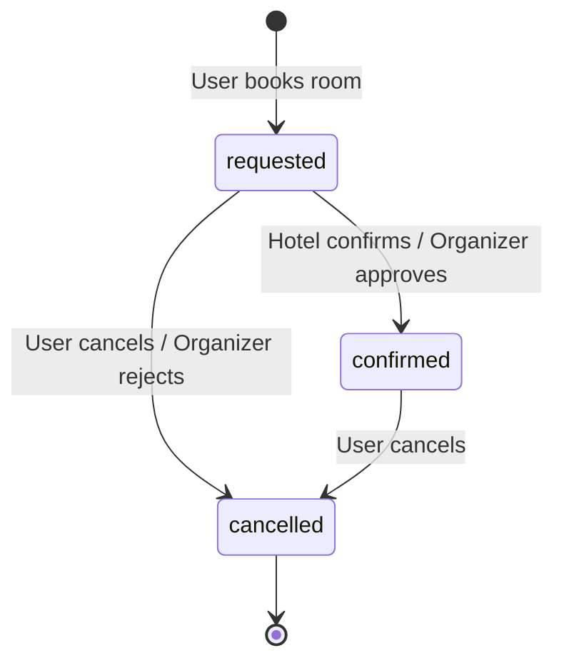

# 4. Data Models

## 4.1 Entity Relationship Overview



## 4.2 User

**Purpose:** Represents an authenticated attendee or organizer.

```go
type User struct {
    ID             int64     `json:"id" db:"id"`
    GitHubID       string    `json:"github_id" db:"github_id"`
    Email          string    `json:"email" db:"email"`
    DisplayName    string    `json:"display_name" db:"display_name"`
    PrivacySetting string    `json:"privacy_setting" db:"privacy_setting"`
    CreatedAt      time.Time `json:"created_at" db:"created_at"`
    UpdatedAt      time.Time `json:"updated_at" db:"updated_at"`
}
```

## 4.3 Conference

**Purpose:** Represents an unconference event with room inventory.

```go
type Conference struct {
    ID          int64     `json:"id" db:"id"`
    Slug        string    `json:"slug" db:"slug"`
    Name        string    `json:"name" db:"name"`
    Description string    `json:"description" db:"description"`
    Location    string    `json:"location" db:"location"`
    StartDate   time.Time `json:"start_date" db:"start_date"`
    EndDate     time.Time `json:"end_date" db:"end_date"`
    Capacity    int       `json:"capacity" db:"capacity"`
    HotelEmail  string    `json:"hotel_email" db:"hotel_email"`
    CreatedAt   time.Time `json:"created_at" db:"created_at"`
}
```

## 4.4 Room

**Purpose:** Represents a hotel room available for booking.

```go
type Room struct {
    ID            int64     `json:"id" db:"id"`
    ConferenceID  int64     `json:"conference_id" db:"conference_id"`
    RoomNumber    string    `json:"room_number" db:"room_number"`
    RoomType      string    `json:"room_type" db:"room_type"`
    PricePerNight float64   `json:"price_per_night" db:"price_per_night"`
    Capacity      int       `json:"capacity" db:"capacity"`
    CreatedAt     time.Time `json:"created_at" db:"created_at"`
}
```

## 4.5 Booking

**Purpose:** Represents a user's room reservation with hotel confirmation workflow.

```go
type BookingStatus string

const (
    BookingStatusRequested BookingStatus = "requested"
    BookingStatusConfirmed BookingStatus = "confirmed"
    BookingStatusCancelled BookingStatus = "cancelled"
)

type Booking struct {
    ID             int64          `json:"id" db:"id"`
    RoomID         int64          `json:"room_id" db:"room_id"`
    UserID         int64          `json:"user_id" db:"user_id"`
    ConferenceID   int64          `json:"conference_id" db:"conference_id"`
    Status         BookingStatus  `json:"status" db:"status"`
    PrivacySetting string         `json:"privacy_setting" db:"privacy_setting"`
    Notes          string         `json:"notes" db:"notes"`
    CreatedAt      time.Time      `json:"created_at" db:"created_at"`
    ConfirmedAt    *time.Time     `json:"confirmed_at,omitempty" db:"confirmed_at"`
    CancelledAt    *time.Time     `json:"cancelled_at,omitempty" db:"cancelled_at"`
}
```

**Status Flow:**



## 4.6 RoommateRequest

**Purpose:** Represents an invitation to share a room.

```go
type RoommateRequest struct {
    ID          int64      `json:"id" db:"id"`
    RequesterID int64      `json:"requester_id" db:"requester_id"`
    TargetID    int64      `json:"target_id" db:"target_id"`
    RoomID      int64      `json:"room_id" db:"room_id"`
    Status      string     `json:"status" db:"status"`
    CreatedAt   time.Time  `json:"created_at" db:"created_at"`
    RespondedAt *time.Time `json:"responded_at,omitempty" db:"responded_at"`
}
```

## 4.7 ConferenceOrganizer

**Purpose:** Junction table linking users to conferences they organize.

```go
type ConferenceOrganizer struct {
    ID           int64     `json:"id" db:"id"`
    ConferenceID int64     `json:"conference_id" db:"conference_id"`
    UserID       int64     `json:"user_id" db:"user_id"`
    Role         string    `json:"role" db:"role"`
    CreatedAt    time.Time `json:"created_at" db:"created_at"`
}
```

---
