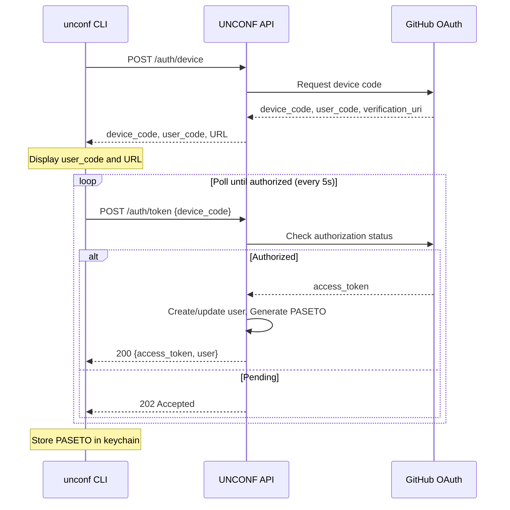

# 5. API Specification

UNCONF uses a **RESTful API** with JSON payloads.

**Base URL:** `https://api.unconf.dev/v1` (production)  
**Content-Type:** `application/json`  
**Authentication:** Bearer token (PASETO) for protected endpoints
**Token Profile:** PASETO `v4.local` with claims: `sub`, `role`, `conference_slug`, `iat`, `exp`

## 5.1 Endpoints Summary

| Method | Path | Description | Auth |
|--------|------|-------------|------|
| GET | /health | Health check | No |
| POST | /auth/device | Initiate GitHub device flow | No |
| POST | /auth/token | Exchange device code for token | No |
| POST | /auth/refresh | Rotate access token | Yes |
| POST | /auth/revoke | Revoke current token/session | Yes |
| GET | /auth/sessions | List active sessions for current user | Yes |
| DELETE | /auth/sessions/{session_id} | Revoke specific session | Yes |
| POST | /auth/revoke-others | Revoke all sessions except current | Yes |
| GET | /conferences | List conferences | No |
| GET | /conferences/{slug} | Get conference details | No |
| POST | /conferences | Create conference | Yes (Organizer) |
| GET | /conferences/{slug}/attendees | List attendees | Yes |
| GET | /conferences/{slug}/rooms | List rooms with availability | No |
| POST | /conferences/{slug}/rooms | Add room | Yes (Organizer) |
| GET | /bookings | Get user's bookings | Yes |
| POST | /bookings | Create booking | Yes |
| DELETE | /bookings/{id} | Cancel booking | Yes |
| PUT | /bookings/{id}/confirm | Confirm booking | Yes (Organizer) |
| GET | /requests | Get roommate requests | Yes |
| POST | /requests | Send roommate request | Yes |
| PUT | /requests/{id}/accept | Accept request | Yes |
| PUT | /requests/{id}/decline | Decline request | Yes |
| GET | /users/me | Get current user | Yes |
| PUT | /users/me | Update profile | Yes |
| GET | /conferences/{slug}/export | Export CSV | Yes (Organizer) |

## 5.2 Authentication Flow

## 5.3 Token Claim Validation Policy

- **Required Claims:** `iss`, `aud`, `sub`, `role`, `iat`, `nbf`, `exp`, `jti`
- **Issuer Rule:** `iss` must exactly match `unconf-api`
- **Audience Rule:** `aud` must contain `unconf-cli`
- **Time Rules:** reject tokens with missing/invalid `nbf`/`exp`; enforce max clock skew of ±60s
- **Token Age Rule:** reject tokens older than 24h based on `iat`, even if `exp` is malformed/overlong
- **Failure Behavior:** invalid claims return `401` with normalized auth error code; no partial authorization

## 5.4 Token Lifecycle Controls

- **Access Token TTL:** 24 hours (PASETO `v4.local`)
- **Refresh Flow:** `POST /auth/refresh` rotates token and invalidates prior token
- **Revocation Flow:** `POST /auth/revoke` revokes current token/session immediately
- **Replay Protection:** include `jti`; maintain denylist for revoked/rotated tokens until expiry
- **Logout Semantics:** CLI `unconf logout` clears keychain token and calls revocation endpoint when online

## 5.5 Session Governance Model

- **Session Identity:** each login creates `session_id` + device label (user-provided or derived)
- **Session Binding:** token embeds `sid` claim mapped to server-side session record
- **Session List:** `GET /auth/sessions` returns active sessions with `session_id`, `device`, `created_at`, `last_seen_at`, `current`
- **Selective Revocation:** `DELETE /auth/sessions/{session_id}` revokes one session and its active token chain
- **Global Cleanup:** `POST /auth/revoke-others` revokes all sessions except current
- **Propagation Target:** revoked sessions become unusable within 60 seconds

## 5.6 Authorization Matrix

| Endpoint Pattern | Attendee | Organizer | Notes |
|------------------|----------|-----------|-------|
| `GET /conferences*` | ✅ | ✅ | Public conference read endpoints remain unauthenticated where specified |
| `GET /bookings`, `POST /bookings`, `DELETE /bookings/{id}` | ✅ (own resources) | ✅ | Enforce ownership unless organizer override is required |
| `GET /requests`, `POST /requests`, `PUT /requests/{id}/*` | ✅ (own requests) | ✅ | Ownership checks on source/target user |
| `GET/PUT /users/me` | ✅ | ✅ | Self-service profile only |
| `POST /conferences`, `POST /conferences/{slug}/rooms`, `PUT /bookings/{id}/confirm`, `GET /conferences/{slug}/export` | ❌ | ✅ | Organizer role required for conference scope |

---
