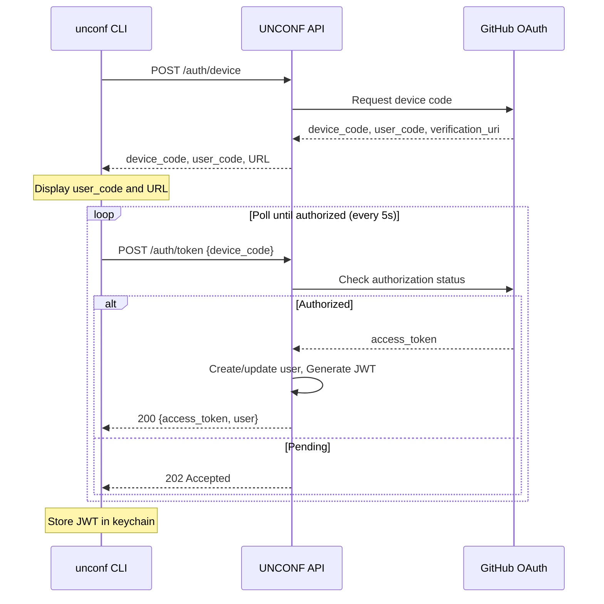

# 5. API Specification

UNCONF uses a **RESTful API** with JSON payloads.

**Base URL:** `https://api.unconf.dev/v1` (production)  
**Content-Type:** `application/json`  
**Authentication:** Bearer token (JWT) for protected endpoints

## 5.1 Endpoints Summary

| Method | Path | Description | Auth |
|--------|------|-------------|------|
| GET | /health | Health check | No |
| POST | /auth/device | Initiate GitHub device flow | No |
| POST | /auth/token | Exchange device code for token | No |
| GET | /conferences | List conferences | No |
| GET | /conferences/{slug} | Get conference details | No |
| POST | /conferences | Create conference | Yes (Organizer) |
| GET | /conferences/{slug}/attendees | List attendees | Yes |
| GET | /conferences/{slug}/rooms | List rooms with availability | No |
| POST | /conferences/{slug}/rooms | Add room | Yes (Organizer) |
| GET | /bookings | Get user's bookings | Yes |
| POST | /bookings | Create booking | Yes |
| DELETE | /bookings/{id} | Cancel booking | Yes |
| PUT | /bookings/{id}/confirm | Confirm booking | Yes (Organizer) |
| GET | /requests | Get roommate requests | Yes |
| POST | /requests | Send roommate request | Yes |
| PUT | /requests/{id}/accept | Accept request | Yes |
| PUT | /requests/{id}/decline | Decline request | Yes |
| GET | /users/me | Get current user | Yes |
| PUT | /users/me | Update profile | Yes |
| GET | /conferences/{slug}/export | Export CSV | Yes (Organizer) |

## 5.2 Authentication Flow

---
