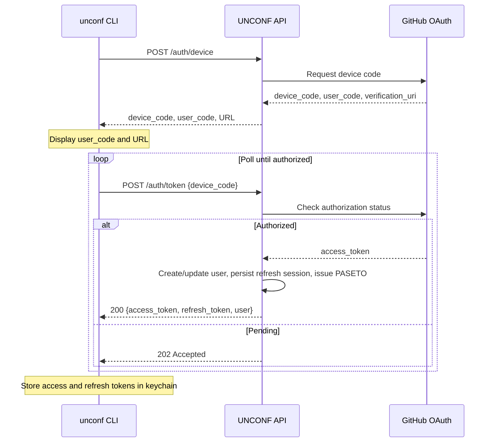

# 5. API Specification

UNCONF uses a **RESTful API** with JSON payloads.

**Default local base URL:** `http://localhost:8080`  
**Production base URL:** deployment-specific  
**Content-Type:** `application/json`  
**Authentication:** Bearer token (PASETO) for protected endpoints  
**Token Profile:** PASETO `v4.local` with claims `iss`, `aud`, `sub`, `sid`, `iat`, `nbf`, `exp`, and `jti`

## 5.1 Endpoints Summary

### Registered in `internal/api/routes.go`

| Method | Path | Description | Auth | Status |
|--------|------|-------------|------|--------|
| GET | /health | Health check | No | Implemented |
| POST | /auth/device | Initiate GitHub device flow | No | Implemented |
| POST | /auth/token | Exchange device code for access and refresh tokens | No | Implemented |
| POST | /auth/refresh | Rotate access and refresh tokens | No | Implemented |
| POST | /auth/revoke | Revoke current authenticated session | Yes | Implemented |
| GET | /auth/sessions | List active authenticated sessions | Yes | Implemented |
| DELETE | /auth/sessions/{session_id} | Revoke selected authenticated session | Yes | Implemented |
| POST | /auth/revoke-others | Revoke all authenticated sessions except current | Yes | Implemented |
| GET | /conferences | List conferences | No | Implemented |
| GET | /conferences/{slug} | Get conference details | No | Implemented |
| POST | /conferences | Create conference | Yes | Implemented |
| PUT | /conferences/{slug} | Update conference | Yes (Organizer) | Implemented |
| GET | /conferences/{slug}/attendees | List attendees | Yes | Implemented |
| GET | /conferences/{slug}/dashboard | Get organizer dashboard data | Yes (Organizer) | Implemented |
| GET | /conferences/{slug}/export | Export bookings as CSV | Yes (Organizer) | Implemented |
| GET | /conferences/{slug}/rooms | List rooms with availability | No | Implemented |
| POST | /conferences/{slug}/rooms | Add room | Yes (Organizer) | Implemented |
| PUT | /conferences/{slug}/rooms/{number} | Update room | Yes (Organizer) | Implemented |
| DELETE | /conferences/{slug}/rooms/{number} | Remove room | Yes (Organizer) | Implemented |
| POST | /conferences/{slug}/organizers | Add organizer | Yes (Owner) | Implemented |
| DELETE | /conferences/{slug}/organizers/{userID} | Remove organizer | Yes (Owner) | Implemented |
| GET | /bookings | Get current user's active bookings | Yes | Implemented |
| DELETE | /bookings/{id} | Cancel booking | Yes | Implemented |
| POST | /requests | Send roommate request | Yes | Implemented |
| GET | /requests | Get roommate requests | Yes | Implemented |
| PUT | /requests/{id}/accept | Accept roommate request | Yes | Implemented |
| PUT | /requests/{id}/decline | Decline roommate request | Yes | Implemented |
| GET | /users/me | Get current user profile | Yes | Implemented |
| PUT | /users/me | Update current user profile | Yes | Implemented |

### Documented Target Endpoints Not Yet Wired

| Method | Path | Note |
|--------|------|------|
| POST | /bookings | Client, TUI, and service logic exist, but no handler method or route registration is currently present |
| PUT | /bookings/{id}/confirm | Organizer confirmation flow remains planned only |

## 5.2 Authentication Flow

## 5.3 Token Claim Validation Policy

- **Required Claims:** `iss`, `aud`, `sub`, `sid`, `iat`, `nbf`, `exp`, `jti`
- **Issuer Rule:** `iss` must exactly match `unconf-api`
- **Audience Rule:** `aud` must exactly match `unconf-cli`
- **Time Rules:** reject tokens with missing or invalid `nbf` or `exp`; enforce max clock skew of ±60s
- **Token Age Rule:** reject tokens older than 24h based on `iat`, even if `exp` is malformed or overlong
- **Failure Behavior:** invalid claims return `401` with normalized auth error codes; no partial authorization

## 5.4 Token Lifecycle Controls

- **Access Token TTL:** 24 hours (PASETO `v4.local`)
- **Refresh Token TTL:** 7 days (stored server-side as hashed refresh-session rows)
- **Refresh Flow:** `POST /auth/refresh` is unauthenticated, accepts `refresh_token` in the request body, rotates both access and refresh tokens, and invalidates the previous refresh token
- **Revocation Flow:** `POST /auth/revoke` revokes the current authenticated session using the `sid` claim from the access token
- **Logout Semantics:** CLI `unconf logout` clears local credentials and calls the revoke endpoint when possible
- **Current Gap:** advanced booking confirmation (`PUT /bookings/{id}/confirm`) and booking-create route exposure remain planned-only in router docs.

## 5.5 Session Governance Model

- **Session Identity:** each login creates a refresh-session record tied to a generated session ID
- **Session Binding:** access tokens embed `sid`, and refresh-token rotation updates the matching refresh-session record
- **Implemented Operations:** refresh-token rotation, current-session revocation, session listing, targeted revocation, and revoke-all-others
- **Planned Operations:** none for core session-governance controls in Epic 1 scope
- **Data Model Reality:** refresh-session persistence now includes per-session client metadata for listing and governance tooling

## 5.6 Authorization Matrix

| Endpoint Pattern | Attendee | Organizer | Notes |
|------------------|----------|-----------|-------|
| `GET /conferences*`, `GET /conferences/{slug}/rooms` | ✅ | ✅ | Public read endpoints are intentionally unauthenticated |
| `GET /bookings`, `DELETE /bookings/{id}`, `GET /requests`, `POST /requests`, `PUT /requests/{id}/*`, `GET/PUT /users/me`, `POST /auth/revoke` | ✅ (own resources) | ✅ (own resources) | Ownership and identity come from the authenticated access token |
| `POST /conferences` | ⚠️ | ✅ | Authenticated creator bootstrap is allowed for the first conference; later creates require existing organizer membership in service logic |
| `PUT /conferences/{slug}`, `POST/PUT/DELETE /conferences/{slug}/rooms`, `GET /conferences/{slug}/dashboard`, `GET /conferences/{slug}/export` | ❌ | ✅ (Organizer) | Guarded by organizer middleware |
| `POST/DELETE /conferences/{slug}/organizers*` | ❌ | ✅ (Owner) | Guarded by owner-only organizer middleware |
| `POST /bookings`, `PUT /bookings/{id}/confirm` | Planned | Planned | Still part of the target design, but not currently exposed in the router |

---
