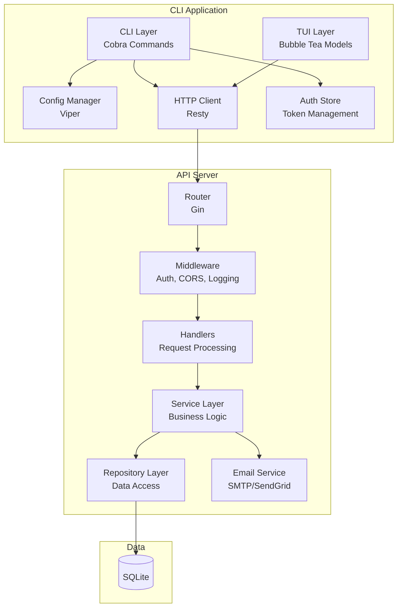

# 6. Components

## 6.1 Component Overview

## 6.2 Component Responsibilities

| Component | Responsibility |
|-----------|----------------|
| **CLI Layer** | Parse commands, flags; orchestrate TUI and API calls |
| **TUI Layer** | Render interactive terminal interfaces (rooms, wizard, dashboard) |
| **Config Manager** | Load/save configuration from multiple sources |
| **HTTP Client** | Make authenticated API calls with retry logic |
| **Auth Store** | Secure token storage (OS keychain) |
| **API Router** | Route HTTP requests, apply middleware |
| **Middleware** | Auth, CORS, logging, recovery |
| **Handlers** | Request validation, response formatting |
| **Service Layer** | Business logic (BookingService, RoomService, etc.) |
| **Repository Layer** | Data access abstraction |
| **Email Service** | Template rendering, SMTP delivery |

---
