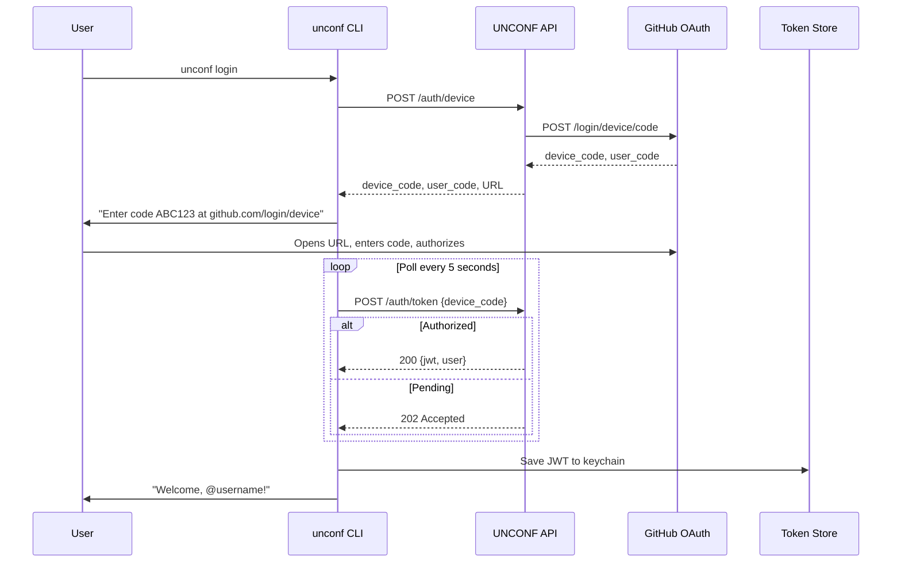
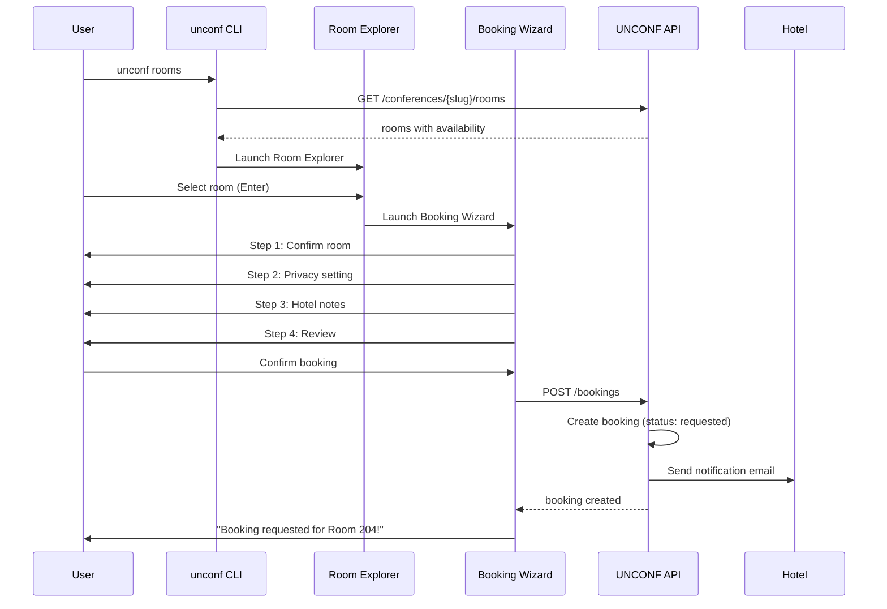
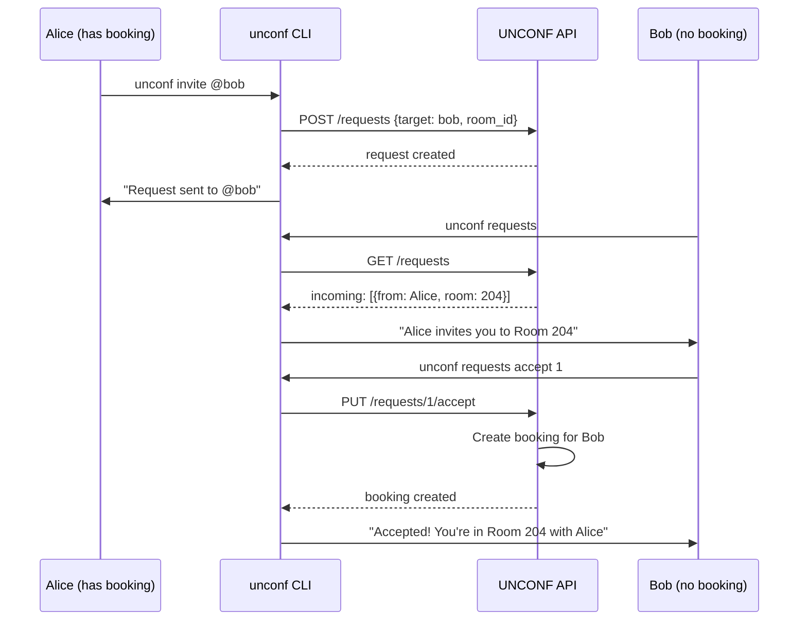
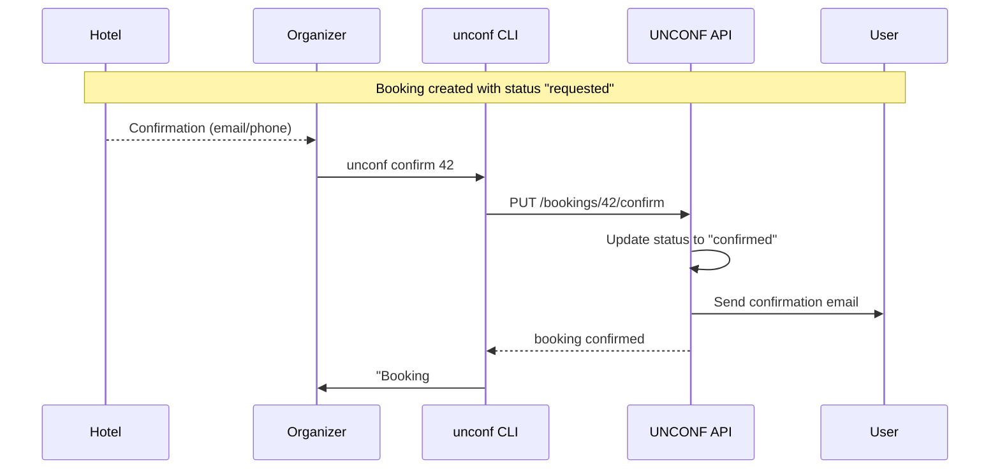

# 8. Core Workflows

## 8.1 User Login Flow

```mermaid
sequenceDiagram
    participant User
    participant CLI as unconf CLI
    participant API as UNCONF API
    participant GH as GitHub OAuth
    participant Store as Token Store

    User->>CLI: unconf login
    CLI->>API: POST /auth/device
    API->>GH: POST /login/device/code
    GH-->>API: device_code, user_code
    API-->>CLI: device_code, user_code, URL
    
    CLI->>User: "Enter code ABC123 at github.com/login/device"
    User->>GH: Opens URL, enters code, authorizes
    
    loop Poll every 5 seconds
        CLI->>API: POST /auth/token {device_code}
        alt Authorized
            API-->>CLI: 200 {jwt, user}
        else Pending
            API-->>CLI: 202 Accepted
        end
    end
    
    CLI->>Store: Save JWT to keychain
    CLI->>User: "Welcome, @username!"
```

## 8.2 Room Booking Flow (TUI)

```mermaid
sequenceDiagram
    participant User
    participant CLI as unconf CLI
    participant TUI as Room Explorer
    participant Wizard as Booking Wizard
    participant API as UNCONF API
    participant Hotel

    User->>CLI: unconf rooms
    CLI->>API: GET /conferences/{slug}/rooms
    API-->>CLI: rooms with availability
    CLI->>TUI: Launch Room Explorer
    
    User->>TUI: Select room (Enter)
    TUI->>Wizard: Launch Booking Wizard
    
    Wizard->>User: Step 1: Confirm room
    Wizard->>User: Step 2: Privacy setting
    Wizard->>User: Step 3: Hotel notes
    Wizard->>User: Step 4: Review
    User->>Wizard: Confirm booking
    
    Wizard->>API: POST /bookings
    API->>API: Create booking (status: requested)
    API->>Hotel: Send notification email
    API-->>Wizard: booking created
    
    Wizard->>User: "Booking requested for Room 204!"
```

## 8.3 Roommate Request Flow

```mermaid
sequenceDiagram
    participant Alice as Alice (has booking)
    participant CLI as unconf CLI
    participant API as UNCONF API
    participant Bob as Bob (no booking)

    Alice->>CLI: unconf invite @bob
    CLI->>API: POST /requests {target: bob, room_id}
    API-->>CLI: request created
    CLI->>Alice: "Request sent to @bob"
    
    Bob->>CLI: unconf requests
    CLI->>API: GET /requests
    API-->>CLI: incoming: [{from: Alice, room: 204}]
    CLI->>Bob: "Alice invites you to Room 204"
    
    Bob->>CLI: unconf requests accept 1
    CLI->>API: PUT /requests/1/accept
    API->>API: Create booking for Bob
    API-->>CLI: booking created
    CLI->>Bob: "Accepted! You're in Room 204 with Alice"
```

## 8.4 Booking Confirmation Flow (Organizer)

```mermaid
sequenceDiagram
    participant Hotel
    participant Organizer
    participant CLI as unconf CLI
    participant API as UNCONF API
    participant User

    Note over User,Hotel: Booking created with status "requested"
    
    Hotel-->>Organizer: Confirmation (email/phone)
    
    Organizer->>CLI: unconf confirm 42
    CLI->>API: PUT /bookings/42/confirm
    API->>API: Update status to "confirmed"
    API->>User: Send confirmation email
    API-->>CLI: booking confirmed
    CLI->>Organizer: "Booking #42 confirmed"
```

---
